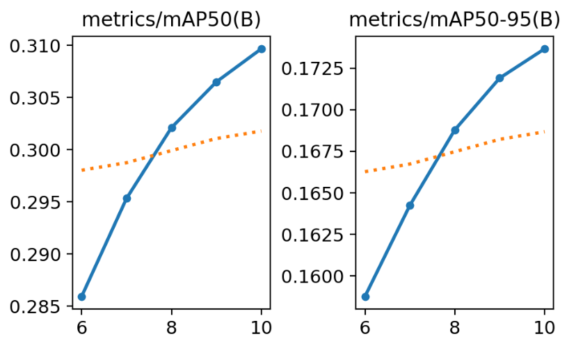
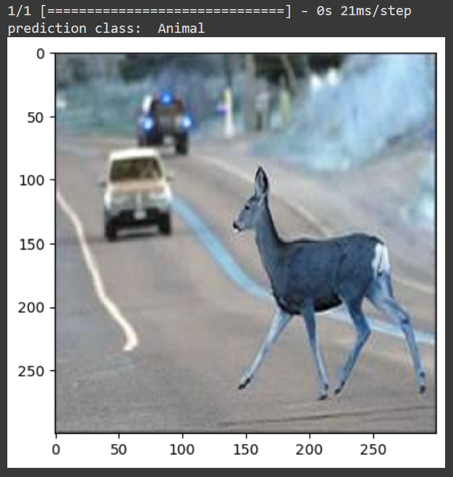

# Hazard Detection in Self-driving Vehicles
Link to presentation slides [here.](https://github.com/mattwyz/CS-766-Project/blob/main/Presentation_Slides.pdf)\
Link to Github repository [here.](https://github.com/mattwyz/CS-766-Project)

# Motivation and Problem Statement
Every year there are more electric and self driving vehicles on the roads, and an important part of these vehicles is ensuring the occupants and other drivers' safety.
A major part of this safety guarantee comes in the form of reliable hazard detection and taking possible preventative measures based on that data.
For our project we wanted to explore how this hazard detection can be completed through the means of computer vision using machine learning.\
\
We set out to make a simple model that could classify multiple different types of hazards from input images, and we later explored using an established model and a large dataset to achieve more hazard and road feature detection for both images and video inputs.
# Methodology
## Datasets and Preprocessing
For our project we used two different datasets for our individual classification and detection models.\
\
For our classification model we used a dataset found on [Kaggle](https://www.kaggle.com/datasets/virenbr11/pothole-and-plain-rode-images/data) which included 740
images of roads with and without potholes that were scraped from google. Before training, we removed the images that had poor quality or did not accurately match their corresponding labels.
Then we found and added around 100 images into the dataset in order to create a new class of hazard. When we had the images, we preprocessed them using Keras by resizing and scaling the images for ease of computing.\
\
For our indentification model, we used the [BDD100K](https://www.vis.xyz/bdd100k/) which includes 70,000 images for training, 10,000 images for validation, and 20,000 images for testing.
Then, using the [FiftyOne](https://docs.voxel51.com/) library, we converted the dataset to be compatible with the YOLO architechural model, which consisted of storing the coordinates of the images, along with other data
in a text file for each image.

## Model Architectures 
The classification model uses the VGG16 architecture that was described by NK. Simonyan and A. Zisserman from the University of Oxford in 2014. It was described in their paper "Very Deep Convolutional Networks for Large-Scale Image Recognition." In the VGG16 architecture, images pass through sequential layers that include two convolutional layers followed by a max-pooling layer, continuing with more convolutions and pooling until reaching the fully connected layers. The convolutional layers primarily use small 3×3 filters, with a stride of 1 and padding to preserve spatial resolution, alongside 2×2 max-pooling layers with a stride of 2. We replicated this architecture using Keras. The below image offers a visual approximation of the implemented architecture.

\
\
The detection model we applied in this project is Yolov8n, released by Ultralytics in 2023. Visual object detection algorithms are categorized into two types: one-stage and two-stage. We used Yolov8 because one-stage algorithms process images through the network model once and generate all the bounding boxes in a single pass, making them quick and highly suitable for real-time detection scenarios. Similar to Yolov5, YOLOv8 uses a similar backbone with some changes on the CSPLayer (c2f module) to improve detection accuracy and has been proven effective in a variety of computer vision tasks and various real-time object detecting scenarios. YOLOv8 can be run from the command line interface (CLI), or it can also be installed as a PIP package. In this project, we applied it in the CLI. 

# Results
## Classification 
The results for the classification model were measured by inspecting the validation accuracy given by the model.
In our case, we first tested using the binary classification model in order to create a baseline of performance for the model, and then we added another class to determine how perforance was altered.

The above image shows the training and validation accuracy for the classification model when 2 classes were use and it was trained for 10 epochs. Training accuracy was very high at over 97 percent and the validation accuracy was slightly lower at about 92 percent.

This image shows the same information as the previous image, but for when the model is asked to differentiate between 3 classes instead of 2. As you can see, while the training accuracy was still high, the validation accuracy dropped precipitiously to just of 82 percent. Because of this, we foresaw limited use in further expandning this model and chose to shift focus to a model that uses more data and can detect road objects instead of simply classifying them.

## Detection
Explain metrics

# Demonstrations
## Classification
The following images showcases what the model is capable of. When given a processed input image, the model can predict which class the picture belongs to by outputing a vector that contains the probability that the image corresponds to eash class. With that vector you can find the class with the highest probability and use that to make a prediction on the image.

## Detection
These images are examples of what the model is capable of, it can detect cars, trucks, road signs, and traffic light from various viewpoints and lighting conditions.

The first link below contains footage take by us in Madison during the day, and the second link is a demonstration on video provided by the BDD100K dataset that shows how the model can still work at night in poor lighting conditions. 

[Verification conducted using a video captured by us on John Nolen Drive, Madison, WI.](https://drive.google.com/file/d/1IW957dk0qJjIovECwUIXdjqxlTxDkt-K/view?usp=drive_link)
\
[Demo on a video from Bdd100k at night condition.](https://drive.google.com/file/d/1II44n4NCvpJYYG3uKN_vE9K6-DPWbO6o/view?usp=drive_link)
# References
[1] https://medium.com/codex/vggnet-complete-architecture-5c6fa801502b
\
[2] https://medium.com/@VK_Venkatkumar/yolov8-architecture-cow-counter-with-region-based-dragging-using-yolov8-e75b3ac71ed8
\
[3] K. Simonyan and A. Zisserman, “Very Deep Convolutional Networks for Large-Scale Image Recognition.” arXiv, Apr. 10, 2015. Accessed: May 03, 2024. [Online]. Available: http://arxiv.org/abs/1409.1556
\
[4] C.-Y. Wang, I.-H. Yeh, and H.-Y. M. Liao, “YOLOv9: Learning What You Want to Learn Using Programmable Gradient Information.” arXiv, Feb. 28, 2024. Accessed: May 03, 2024. [Online]. Available: http://arxiv.org/abs/2402.13616
\
[5] J. Terven, D.-M. Córdova-Esparza, and J.-A. Romero-González, “A Comprehensive Review of YOLO Architectures in Computer Vision: From YOLOv1 to YOLOv8 and YOLO-NAS,” MAKE, vol. 5, no. 4, pp. 1680–1716, Nov. 2023, doi: 10.3390/make5040083.

